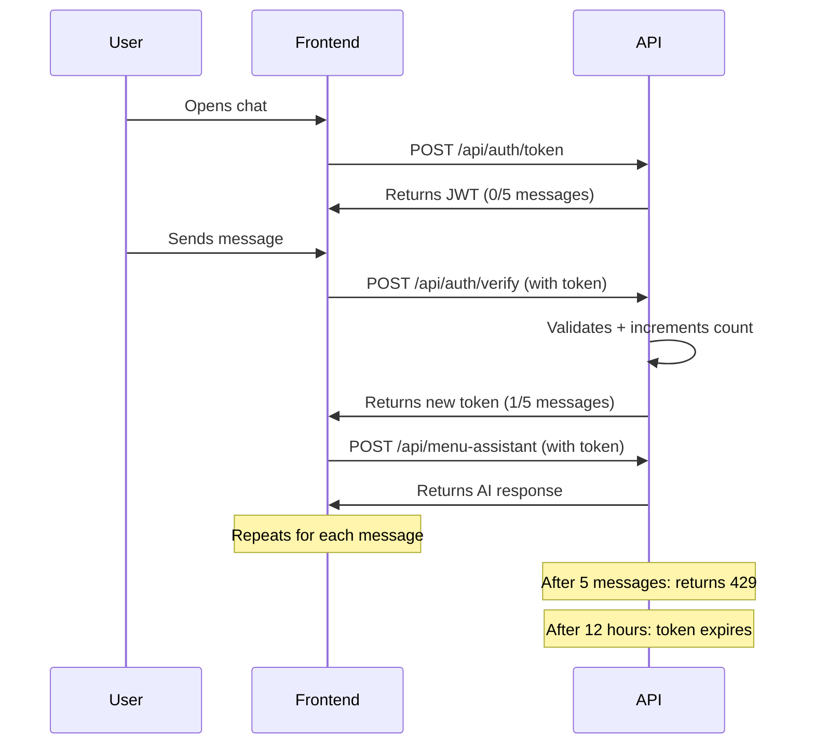

# JWT Authentication Implementation Summary

## ✅ What's Been Implemented

### 1. JWT Token System (Vercel-Compatible)
- **Token Generation** (`/api/auth/token.js`): Creates JWT tokens with user fingerprinting
- **Token Verification** (`/api/auth/verify.js`): Validates and increments message count
- **12-Hour Reset**: Tokens automatically expire after 12 hours

### 2. Security Features
- **Fingerprinting**: Tokens tied to IP address + User-Agent (prevents sharing)
- **Server-side Enforcement**: Can't bypass limits via localStorage clearing
- **Message Limit**: 5 messages per 12-hour period
- **Auto-refresh**: Frontend automatically gets new token when expired

### 3. Frontend Integration
- **SimpleCopilotChat.tsx**: Updated to use JWT authentication
- **deepseek.ts**: New functions for token management
  - `getAuthToken()`: Get or refresh token
  - `verifyAndIncrementToken()`: Validate before each message
  - `askDeepSeek()`: Now requires token parameter

### 4. AI Description Update
- System prompt now mentions the 12-hour message limit
- AI can inform users about remaining messages
- Bilingual support (English/French)

### 5. Deployment Configuration
- **vercel.json**: Routes configured for serverless functions
- **package.json**: JWT dependencies added
- **.env.example**: Template for required environment variables

## 📁 New Files Created

```
api/
├── auth/
│   ├── token.js       # Generate JWT tokens
│   └── verify.js      # Verify and increment tokens
├── deepseek-proxy.cjs # Updated with JWT info in system prompt
vercel.json            # Vercel deployment config
.env.example          # Environment variables template
JWT_SETUP.md          # Detailed setup instructions
```

## 🔧 Modified Files

1. **src/lib/deepseek.ts**
   - Added `TokenInfo` interface
   - Added `getAuthToken()` function
   - Added `verifyAndIncrementToken()` function
   - Updated `askDeepSeek()` to require token

2. **src/components/SimpleCopilotChat.tsx**
   - Replaced localStorage counter with JWT token system
   - Added token initialization on mount
   - Updated send() to use token verification
   - Shows "12h reset" in footer
   - Auto-refreshes expired tokens

3. **api/deepseek-proxy.cjs**
   - Updated system prompt with message limit info

4. **package.json**
   - Added `jsonwebtoken` dependency

## 🚀 How It Works



## 🔐 Security Benefits

| Feature | Before (localStorage) | After (JWT) |
|---------|---------------------|-------------|
| Bypass limit | ✅ Easy (clear storage) | ❌ Impossible |
| Cross-device tracking | ❌ No | ✅ Yes (via fingerprint) |
| API protection | ❌ No | ✅ Server-enforced |
| Reset time | Manual only | ⏰ Auto 12h |
| Cost control | ❌ None | ✅ Strong |

## 📝 Next Steps for Deployment

1. **Set Environment Variables in Vercel**:
   ```bash
   JWT_SECRET=<generate-strong-secret>
   OPENROUTER_API_KEY=<your-key>
   ```

2. **Generate JWT Secret**:
   ```bash
   node -e "console.log(require('crypto').randomBytes(32).toString('hex'))"
   ```

3. **Deploy**:
   ```bash
   vercel --prod
   ```

4. **Test**:
   - Open chat → should auto-initialize token
   - Send 5 messages → should hit limit
   - Wait 12 hours → should reset automatically

## 🎯 User Experience

- **First visit**: Automatically gets 5 messages
- **Messages 1-4**: Normal chat experience
- **Message 5**: Last message, see "0 messages left"
- **After limit**: Shows error, wait 12 hours
- **After 12h**: Auto-refreshes, gets 5 new messages
- **Clear button**: Only clears conversation, not message count

## 💡 Benefits

✅ **Real API protection** - Can't bypass via browser  
✅ **Automatic reset** - No manual intervention needed  
✅ **Cost control** - Predictable API usage  
✅ **User-friendly** - Transparent countdown  
✅ **Vercel-optimized** - Serverless functions  
✅ **No database needed** - Stateless JWT system  

## 🐛 Troubleshooting

**Token expired**: Normal after 12h - auto-refreshes  
**Fingerprint mismatch**: IP/browser changed - gets new token  
**Limit reached**: Sent 5 messages - wait 12h  
**Session not initialized**: Network issue - refresh page
